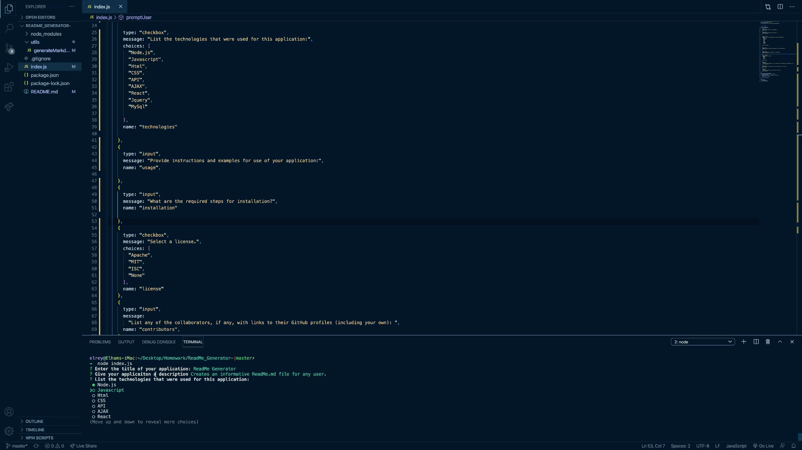

# ReadMe Generator
  

  Contents of This File
  * [Description](#description)
  * [Technologies](#technologies)
  * [Installation](#installation)
  * [Contributors](#contributors)
  * [Tests](#tests)
  * [Questions](#questions)
  * [License](#license)
  ---
  

  ---
  # Description 
  Creates an informative ReadMe.md file for any user.

  ### Technologies:
  * Node.js
  * Javascript
 ---

  ### Installation:
  * run index.js on integrated terminal (VSCode) / Terminal (MacOs) / Git Bash (Windows)
  * npm install (npm i)
  * run node index.js

  #### Usage :
  * Clone repository 
  * Instal node.js

 #### License:
  
  ---

  #### Tests:
  NaN

  ### Contributors:
  Elham T.Hussain :https://github.com/ElhamFabe/ReadMe_Generator

  ### Questions:
  Any questions about this applicaiton please contact via email : Elhamfabe@gmail.com
 ---

  
